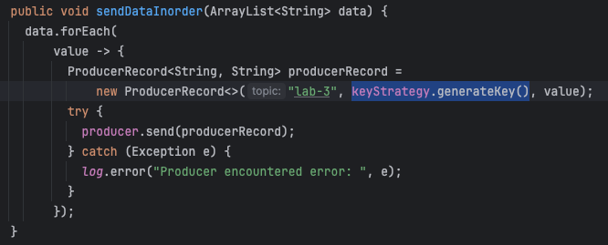
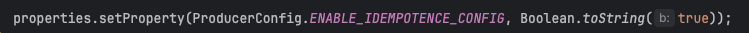
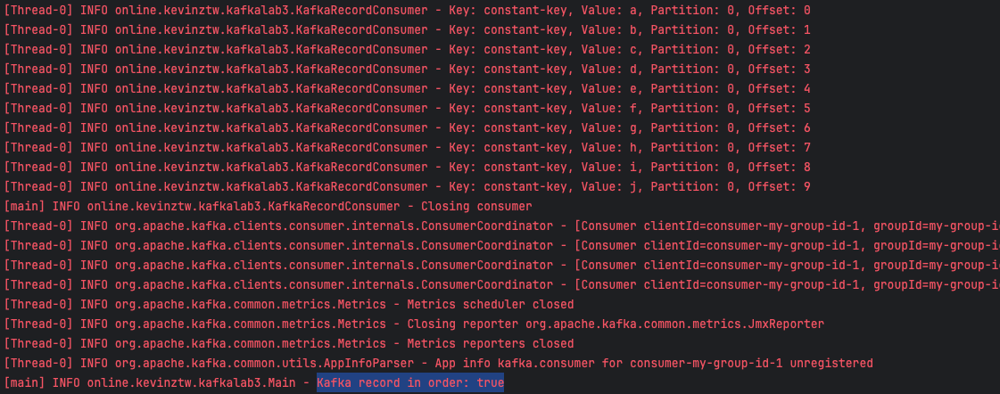
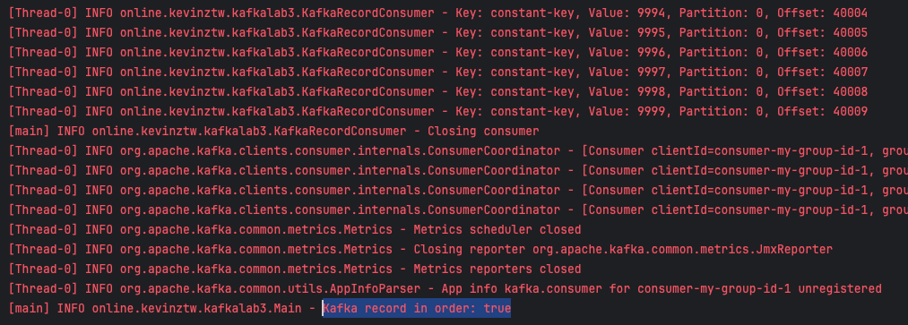
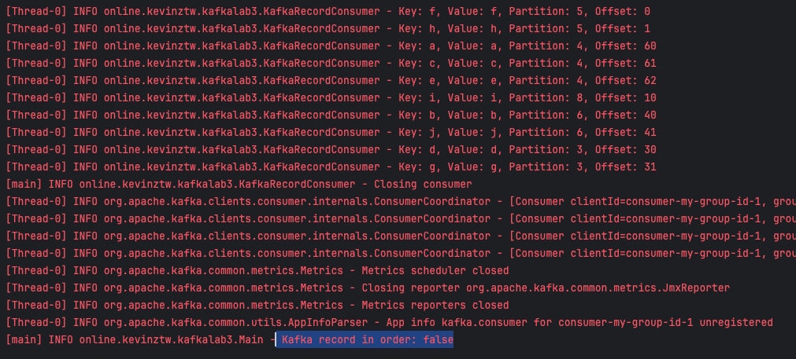

# Kafka Lab 3

## Introduction

透過創建 producer 以及 consumer 對 Kafka 集群讀寫資料，並希望維持資料的順序性

## Implementation and Results

透過 bash script 創造一個 10 個 partitions 的 topic

```sh
./bin/kafka-topics.sh --create --topic lab-3 --bootstrap-server localhost:8097 --replication-factor 3 --partitions 10
```


Kafka 預設行為在每一個分區發送出的訊息是依序排列的，因此想到的作法是將這些資料都分配到特定的某一分區

在不配置 customPartitioner 的情況下 default 行為應是以 key 值 hash 後作為分區方式，因此使用同樣的 key 來寫入資料



同時為了避免在 broker 出現故障導致 producer retry 重複寫入資料導致順序性錯誤，在 producer 端設置 enable idempotence



以下測試上述的實作方式是否如預期，創建如上 produceer 並且依序寫入 a, b, c, d 等十筆資料至 Kafka 並且運行 consumer

程式執行後也如預期


測試較大量的資料 0~9999 同樣符合順序


(單純觀察) 測試以 value 作為 key, 觀察分配到的分區以及是否 consumer 接到的資料順序


其餘有看到另一方法是在 producer 寫入的資料帶入 TimeStamp 在 consuemr 端 buffer 資料並在一段時間過後對 N
秒前的全部資料做排序，但此做法不符合題意

